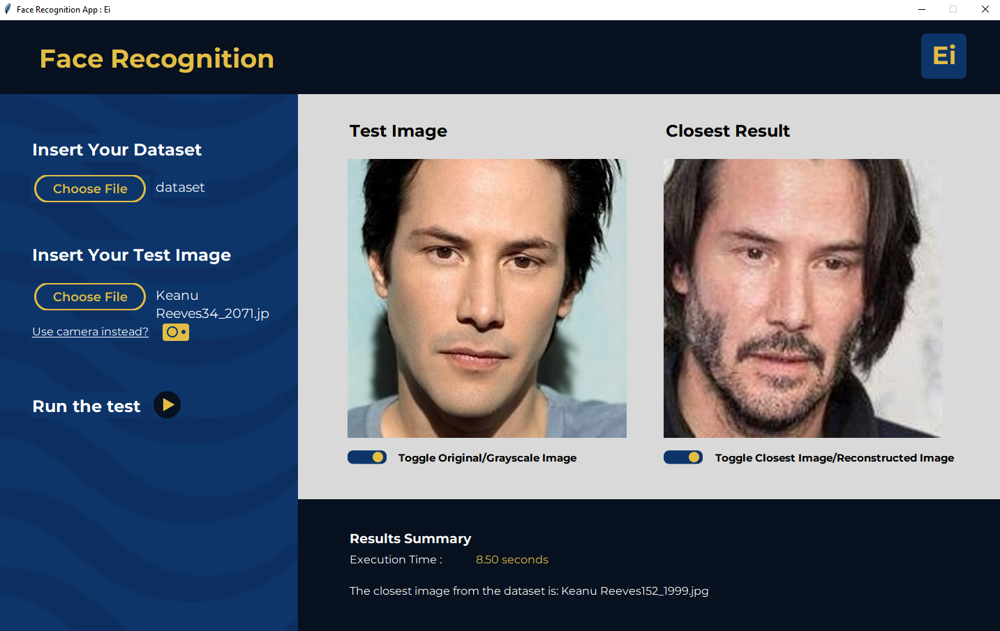
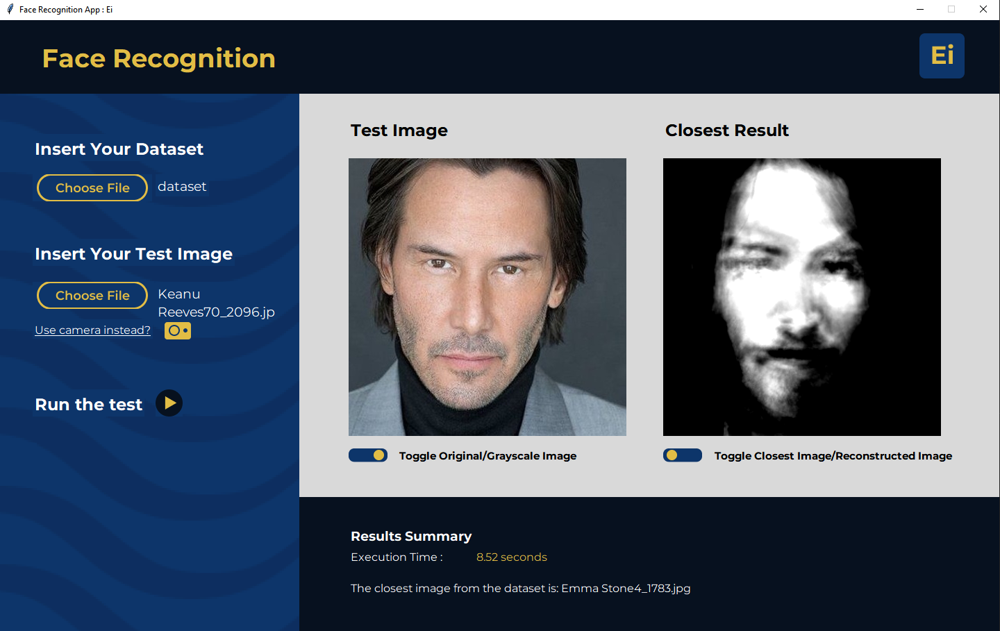
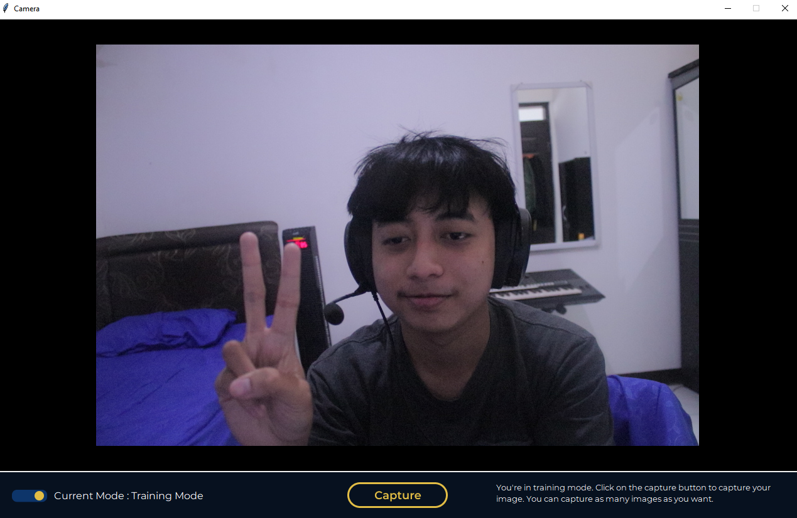

# Tugas Besar 2 Aljabar Linier dan Geometri
## Deskripsi Program 🖥️
> Program ini dibuat untuk memenuhi tugas mata kuliah IF2123 Aljabar Linier dan Geometri tahun ajaran 2022/2023. Program ini 
> memiliki fitur pengenalan wajah dengan menggunakan metode eigenface, principal component analysis (PCA), dan juga euclidean distance.
> User dapat melakukan input dataset citra wajah untuk melakukan training terhadap aplikasi dan input gambar test untuk mencari gambar yang
> paling dekat. User juga dapat melakukan input melalui kamera.

## Technologies Used 🚀
- tkinter v8.6    | Dalam pembuatan Graphical User Interfaces (GUI)
- numpy v1.23.4   | Dalam melakukan operasi array dan matrix sederhana
- Pillow v9.3.0   | Dalam Image Processing
- OpenCV v4.6.0   | Dalam Image Processing and Konversi
- matplotlib v3.6 | Dalam testing algoritma
- pyhton time     | Dalam Tracking waktu eksekusi
- python os       | Dalam pembacaan dan penulisan file ataupun folder
- python math     | Operasi matematika sederhana (square root)

## Features ✨
List fitur yang telah dibuat:
- Pencarian citra wajah terdekat berdasarkan perhitungan eigenface
- Hasil rekonstruksi wajah test image dari eigenfaces
- Input dataset dan test image melalui kamera

## Screenshots 📸
### Hasil Test Face Recognition terhadap Citra Wajah Keanu Eeeves

### Contoh Image Reconstruction dengan Eigenface

### Fitur Input melalui Kamera


## Setup dan Menjalankan Aplikasi ⚙️
1. Pastikan python sudah terinstall dengan benar. Gunakan command line di bawah ini untuk mengecek apakah python sudah terinstall dengan benar atau belum. 
Jika belum maka install terlebih dahulu [disini](https://www.python.org/)
  ```
    python --version
  ```
 2. Install semua library yang diperlukan dalam aplikasi dengan command berikut:
  ```
    pip install opencv-python PILLOW tk numpy matplotlib
  ``` 
 4. Clone repository ini ke local dengan menjalankan kode berikut di terminal
  ```github
    git clone https://github.com/moonawar/Algeo02-21020.git
  ```
 4. Buka terminal atau command line di folder yang sudah di clone
 5. Masuk ke folder src dan jalankan main.py
  ```cmd
    cd src
    python main.py
  ```
Jika ada kegagalan, coba ganti kata python dengan python3 di command line.

## Anggota 👨‍🎓
Program ini dibuat dan dimaintain oleh:
| No | Nama  | NIM  |
|---|---|---|
| 1 | Varraz Hazzandra Abrar  | 13521020  |
| 2 | Athif Nirwasito  | 13521053  |
| 3  | Addin Munawwar Yusuf  | 13521085  |
